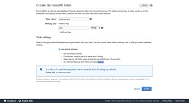
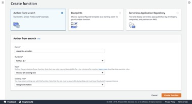
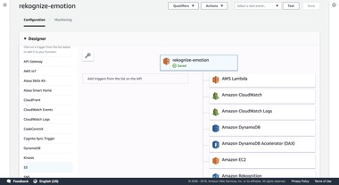
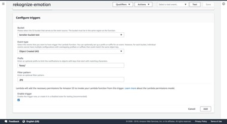
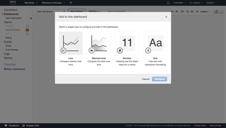
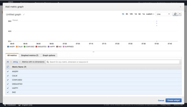
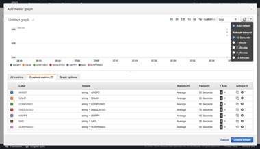

# Extend the project by integrating with Amazon Rekognition#

In this module, you will learn how to integrate the project with Amazon Rekognition and view the output over CloudWatch. 

### Step 1- Create a DynamoDB table: 

1. Go to console.aws.amazon.com and search for DynamoDB
2. Click on Create Table.
3. Next, we need to create the DynamoDB table that will store our output:

Name the table: recognize-emotions

Primary key: s3key

Use default settings

Click on Create. This will create a table in your DynamoDB.

 

### Step 2- Create a lambda function that runs in the cloud

 

The inference lambda function that you deployed earlier will upload the cropped faces to your S3. On S3 upload, this new lambda function gets triggered and runs the Rekognize Emotions API by integrating with Amazon Rekognition. 

To create the lambda function, follow the steps below:

1. Go to lambda console by visiting console.aws.amazon.com/lambda
2. Click on ‘Create function’ and choose Author from scratch
3. Name the function- recognize-emotion. Choose Python 2.7 as the run time
4. For the role, select ‘choose an existing role’ aand choose the “rekognizeEmotion” role we created earlier

 

5. Replace the default script with the script in **recognize-emotions.py (you can find it in the github repo),**

The script does the following functions:

·      Is triggered upon S3

·      Writes metrics to CloudWatch

·      Logs metrics to the DynamoDB table created earlier

 

Once the script is inserted, it should look like the below:

 

6. Next, we need to add the event that triggers this lambda function. This will be an “S3:ObjectCreated” event that happens every time a face is uploaded to the face S3 bucket

 

Add the “S3” trigger:

 

 

With the following configuration:

Bucket name- <your bucket name> (we created this s3 bucket in our earlier steps)

Event type- Object Created

Prefix- faces/

Filter- .jpg

Enable trigger- ON (keep the checkbox on)

 

7. Save the lambda function.

**8. Publish the lambda function.**

 

Now you should start seeing the cropped faces upload to S3 and the emotions populated in the DynamoDB table. To view the emotions, lets create a CloudWatch dashboard.

 

### Step 3- CloudWatch- View the output

 

To view the output of your project:

1. Go to console.aws.amazon.com and search for Cloudwatch
2. Create a dashboard called “sentiment-dashboard”. 
3. Add Line Widget:

 

 

4. Under Custom Namespaces, select “string”, “Metrics with no dimensions”, and then select all metrics:

**NOTE:** These metrics will only appear once they have been sent to Cloudwatch via the Rekognition Lambda. It may take some time for them to appear after your model is deployed and running locally. If they **do not** appear, then there is a problem somewhere in the pipeline.

 

5. Next, set “Auto-refresh” to the smallest interval possible (1h), and change the “Period” to whatever works best for you (1 second or 5 seconds)

 

As the metrics start coming in, you'll see lines being drawn.

 

With this we have come to the end of the session. As part of building this project, you learnt the following:

1. How to build and train a face detection model in SageMaker
2. Modify the DeepLens inference lambda function to upload cropped faces to S3
3. Deploy the inference lambda function and face detection model to DeepLens
4. Create a lambda function to trigger Rekognition to identify emotions
5. Create a DynamoDB table to store the recognized emotions
6. Analyze using CloudWatch

**An overview of the architecture you built:**

 

We hope you enjoyed the session!

 

 

 
