# In this lab we will create a Image Classification model and deploy that model on Deeplens

I will walk you through building a model to classify common objects. This object classification model is based on Caltech-256 dataset and is trained using ResNet network. Through this walk through tutorial, you will build an object classifier that can identify 256 commonly found objects.

***Source code for The SageMaker notebook Sagemaker_Imageclassification.ipynb and related lamda greegrassHelloWorld.py and label file caltech256_labels.txt is attached to this git*** No need to copy paste the code from readme.


To build you own model, you first need to identify a dataset. You can bring your own dataset or use an existing one. In this tutorial, we show you how to build an object detection model in Amazon SageMaker using Caltech-256 image classification dataset.

In order to follow through with this tutorial, ensure that your DeepLens software version is updated to version 1.3+ and above and MXNet version 1.2+

To build this model in Amazon SageMaker, Visit Amazon SageMaker console (https://console.aws.amazon.com/sagemaker/home?region=us-east-1#/dashboard)


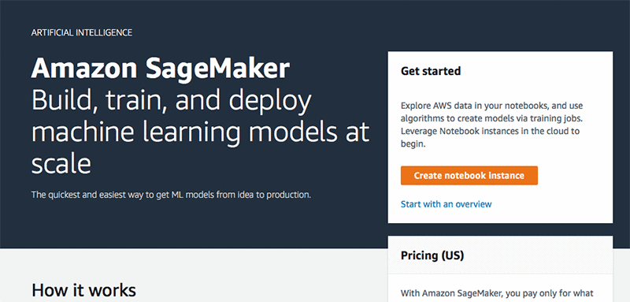


Create notebook instance. Provide the name for your notebook instance and select an instance type (for example ml.t2.medium). Choose to create a new role or use an existing role. Choose Create notebook instance. ***GIVE Notebook Instance unique name e.g. imageclassiciation-name_date***

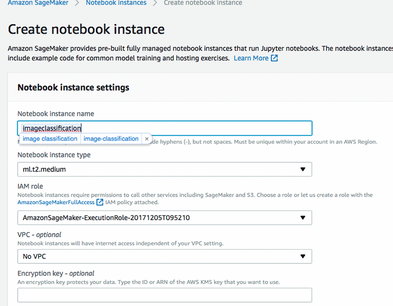


Once your notebook instance is created, open the notebook instance you just created.


You will see the Jupyter notebook hosted in your instance.


Create a new notebook by choosing New and conda_mxnet_p36 kernel.


Let’s start by importing the necessary packages. Importing boto3 SDK for Python allows you to access Amazon services like S3. get_execution_role will allow Amazon SageMaker to assume the role created during instance creation and accesses resources on your behalf.

```
%%time 
import boto3
from sagemaker import get_execution_role
role = get_execution_role()
```

Next we define a bucket which hosts the dataset that will be used. In this example, the dataset is Caltech- 256. Create a bucket in your S3. The name for your bucket must contain the prefix ‘deeplens’. In this example, the bucket is ‘deeplens-imageclassification’. ***Make Sure S3 bucket name is unique, e.g. Deeplens-imageclassfication-name-date***

```
bucket='deeplens-imageclassification' 
Next we define the containers. Containers are docker containers and the training job defined in this notebook will run in the container for your region.

containers = {'us-west-2': '433757028032.dkr.ecr.us-west-2.amazonaws.com/image-classification:latest',
              'us-east-1': '811284229777.dkr.ecr.us-east-1.amazonaws.com/image-classification:latest',
              'us-east-2': '825641698319.dkr.ecr.us-east-2.amazonaws.com/image-classification:latest',
              'eu-west-1': '685385470294.dkr.ecr.eu-west-1.amazonaws.com/image-classification:latest'}
training_image = containers[boto3.Session().region_name]
Next let’s import the dataset and upload it to your S3 bucket. We will download the train and validation sets for Caltech-256 and upload it to the S3 bucket created earlier.

import os 
import urllib.request
import boto3

def download(url):
    filename = url.split("/")[-1]
    if not os.path.exists(filename):
        urllib.request.urlretrieve(url, filename)

        
def upload_to_s3(channel, file):
    s3 = boto3.resource('s3')
    data = open(file, "rb")
    key = channel + '/' + file
    s3.Bucket(bucket).put_object(Key=key, Body=data)

download('http://data.mxnet.io/data/caltech-256/caltech-256-60-train.rec')
upload_to_s3('train', 'caltech-256-60-train.rec')
download('http://data.mxnet.io/data/caltech-256/caltech-256-60-val.rec')
upload_to_s3('validation', 'caltech-256-60-val.rec')
```
Next let’s define the network that we will use to train the dataset. For this tutorial, we will use ResNet network. ResNet is the default image classification model in Amazon SageMaker. In this step, you can customize the hyper parameters of the network to train your dataset.

num_layers lets you define the network depth. ResNet supports multiple network depths. For example: 18, 34, 50, 101, 152, 200 etc. For this example we choose the network depth as 18 so that this model can be trained fast for the workshop purpose. In reality you may want to go with higher number but that may take hours for model to train.

Next we need to specify the input image dimensions. The dataset that we used in this example has the dimensions 224 x 224 and has 3 color channels: RGB.

Next we specify the number of training samples in the training set. For Caltech-256, the number of training samples are 15420.

Next, we specify the number of output classes for the model. In this example, the number of output classes for Caltech-256 is 257.

Batch size refers to the number of training examples utilized in one iteration. You can customize this number based on the computation resources available to you. Epoch is when the entire dataset is processed by the network once. Learning rate determines how fast the weights or coefficients of your network change. You can customize batch size, epochs and learning rates. You can refer to the definitions here: https://docs.aws.amazon.com/sagemaker/latest/dg/IC-Hyperparameter.html.

```
# The algorithm supports multiple network depth (number of layers). They are 18, 34, 50, 101, 152 and 200
# For this training, we will use 18 layers
num_layers = "18" 
# we need to specify the input image shape for the training data
image_shape = "3,224,224"
# we also need to specify the number of training samples in the training set
# for caltech it is 15420
num_training_samples = "15420"
# specify the number of output classes
num_classes = "257"
# batch size for training
mini_batch_size =  "128"
# number of epochs
epochs = "3"
# learning rate
learning_rate = "0.1"
#optimizer
#optimizer ='Adam'
#checkpoint_frequency
checkpoint_frequency = "3"
#scheduler_step
lr_scheduler_step="30,90,180"
#scheduler_factor
lr_scheduler_factor="0.1"
#augmentation_type
augmentation_type="crop_color_transform"
```

To train a model in Amazon SageMaker, you create a training job. The training job includes the following information:

The URL of the Amazon Simple Storage Service (Amazon S3) bucket where you’ve stored the training data.
The compute resources that you want Amazon SageMaker to use for model training. Compute resources are ML compute instances that are managed by Amazon SageMaker.
The URL of the S3 bucket where you want to store the output of the job.
The Amazon Elastic Container Registry path where the training code is stored.
In this sample, we pass the default image classifier (ResNet) built in Amazon SageMaker. The checkpoint_frequency determines the frequency by which model files are stored during training. Since we only need the final model file for deeplens, it is set equal to the number of epochs.

Please make a note of job_name_prefix, S3OutputPath, InstanceType, InstanceCount.

```
%%time
import time
import boto3
from time import gmtime, strftime


s3 = boto3.client('s3')
# create unique job name 
job_name_prefix = 'DEMO-imageclassification'
timestamp = time.strftime('-%Y-%m-%d-%H-%M-%S', time.gmtime())
job_name = job_name_prefix + timestamp
training_params = \
{
    # specify the training docker image
    "AlgorithmSpecification": {
        "TrainingImage": training_image,
        "TrainingInputMode": "File"
    },
    "RoleArn": role,
    "OutputDataConfig": {
        "S3OutputPath": 's3://{}/{}/output'.format(bucket, job_name_prefix)
    },
    "ResourceConfig": {
        "InstanceCount": 1,
        "InstanceType": "ml.p2.8xlarge",
        "VolumeSizeInGB": 50
    },
    "TrainingJobName": job_name,
    "HyperParameters": {
        "image_shape": image_shape,
        "num_layers": str(num_layers),
        "num_training_samples": str(num_training_samples),
        "num_classes": str(num_classes),
        "mini_batch_size": str(mini_batch_size),
        "epochs": str(epochs),
        "learning_rate": str(learning_rate),
        "lr_scheduler_step": str(lr_scheduler_step),
        "lr_scheduler_factor": str(lr_scheduler_factor),
        "augmentation_type": str(augmentation_type),
        "checkpoint_frequency": str(checkpoint_frequency),
        "augmentation_type" : str(augmentation_type)
    },
    "StoppingCondition": {
        "MaxRuntimeInSeconds": 360000
    },
#Training data should be inside a subdirectory called "train"
#Validation data should be inside a subdirectory called "validation"
#The algorithm currently only supports fullyreplicated model (where data is copied onto each machine)
    "InputDataConfig": [
        {
            "ChannelName": "train",
            "DataSource": {
                "S3DataSource": {
                    "S3DataType": "S3Prefix",
                    "S3Uri": 's3://{}/train/'.format(bucket),
                    "S3DataDistributionType": "FullyReplicated"
                }
            },
            "ContentType": "application/x-recordio",
            "CompressionType": "None"
        },
        {
            "ChannelName": "validation",
            "DataSource": {
                "S3DataSource": {
                    "S3DataType": "S3Prefix",
                    "S3Uri": 's3://{}/validation/'.format(bucket),
                    "S3DataDistributionType": "FullyReplicated"
                }
            },
            "ContentType": "application/x-recordio",
            "CompressionType": "None"
        }
    ]
}
print('Training job name: {}'.format(job_name))
print('\nInput Data Location: {}'.format(training_params['InputDataConfig'][0]['DataSource']['S3DataSource']))

```

In the next step, you can check the status of the Job in CloudWatch.

```
# create the Amazon SageMaker training job
sagemaker = boto3.client(service_name='sagemaker')
sagemaker.create_training_job(**training_params)

# confirm that the training job has started
status = sagemaker.describe_training_job(TrainingJobName=job_name)['TrainingJobStatus']
print('Training job current status: {}'.format(status))

try:
    # wait for the job to finish and report the ending status
    sagemaker.get_waiter('training_job_completed_or_stopped').wait(TrainingJobName=job_name)
    training_info = sagemaker.describe_training_job(TrainingJobName=job_name)
    status = training_info['TrainingJobStatus']
    print("Training job ended with status: " + status)
except:
    print('Training failed to start')
     # if exception is raised, that means it has failed
    message = sagemaker.describe_training_job(TrainingJobName=job_name)['FailureReason']
    print('Training failed with the following error: {}'.format(message))
```

    
To check the status, go to SageMaker dashboard and choose Jobs. Select the Job you have defined and scroll down to the details page on Job to “monitor” section. You will see a link to logs which will open CloudWatch.

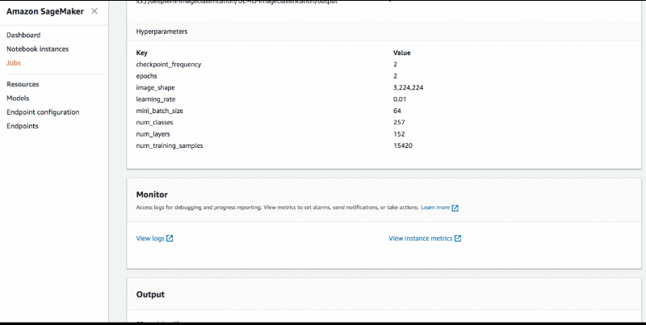

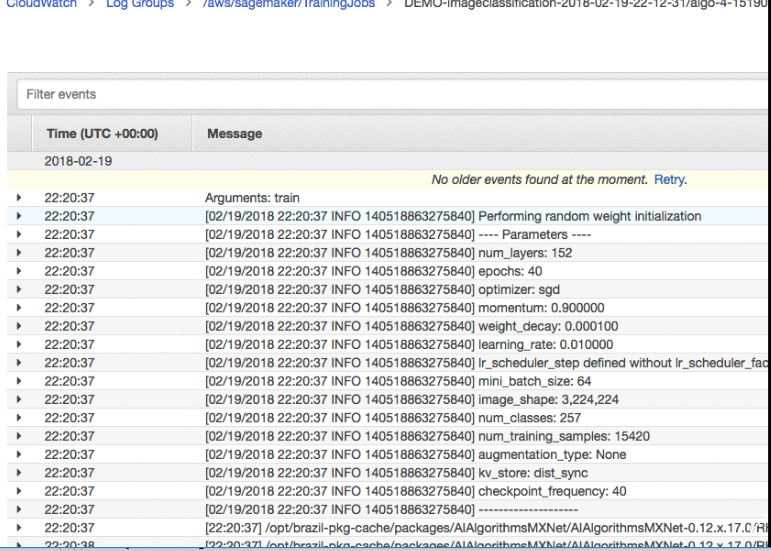

Once you run the notebook, it will create a model which can be directly imported into AWS DeepLens as a project. Once the training is complete, your model is ready to be imported in to AWS DeepLens.

Ensure that the mxnet version on your AWS DeepLens is 1.2.0 +. In case you need to upgrade, you can type the following code in your Ubuntu terminal.

sudo pip3 install mxnet==1.2.0

Now Log into AWS DeepLens Console (https://console.aws.amazon.com/deeplens/home?region=us-east-1#projects)


Create new project


Choose – Create a new blank project


Name project – e.g. imageclassification
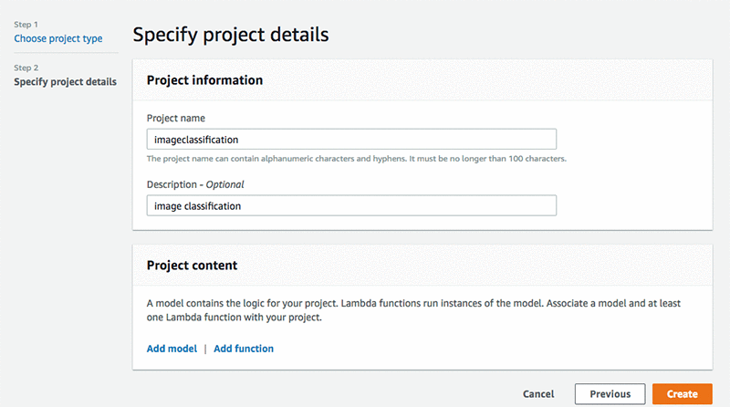

Select Add Model – this will open new page, “Import model to AWS Deeplens”

Select Amazon SageMaker trained model, in the Model setting, Amazon SageMaker training job ID drop down, select the imageclassification model you selected. In Model name choose model name e.g. imageclassification, keep description as image classification.

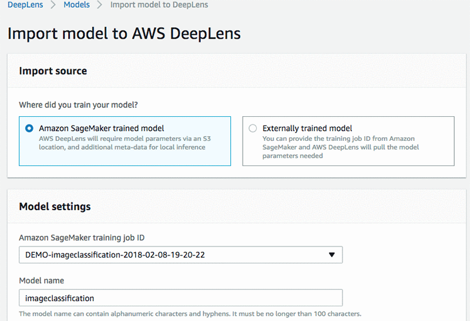


Go back to import model screen, select the imageclassification model you imported earlier, click Add model. Once model is added, you need to add a lambda function by choosing Add function.

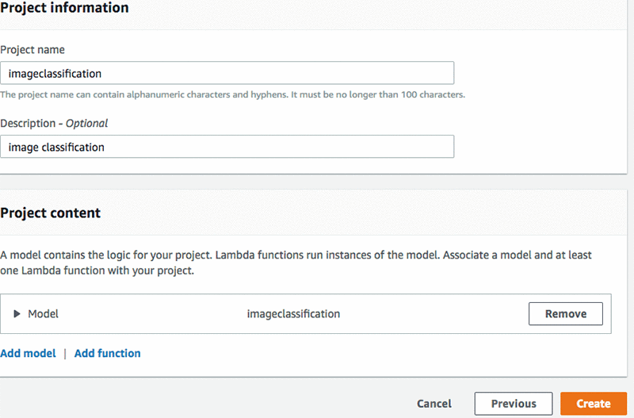

To create a AWS DeepLens lambda function, you can follow the blog post: Dive deep into AWS DeepLens Lambda functions and the new model optimizer.

To provide an easy reference, we have provided the instructions for the lambda function for image classification below.

To create an inference Lambda function, use the AWS Lambda console and follow the steps below:

Choose Create function. You customize this function to run inference for your deep learning models.


Choose Blueprints
Search for the greengrass-hello-world blueprint.

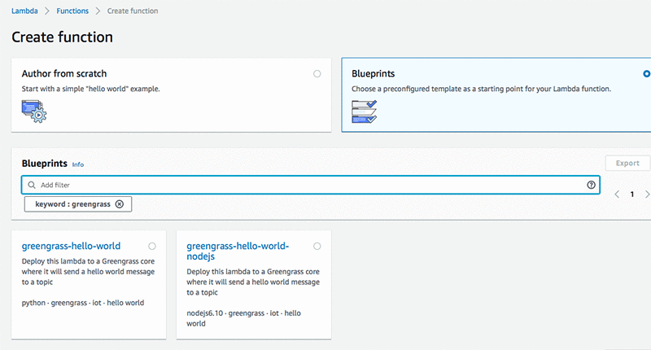

Give your Lambda function the same name as your model e.g. imageclassification_lambda.
Choose an existing IAM role: AWSDeepLensLambdaRole. You must have created this role as part of the registration process.

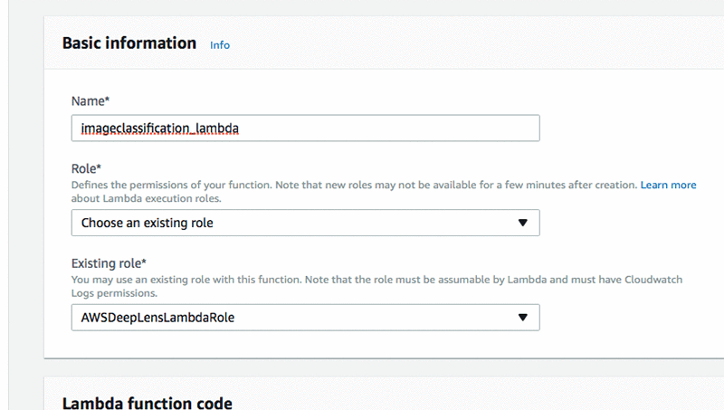

Choose Create function.
In Function code, make sure the handler is greengrassHelloWorld.function_handler.
In the GreengrassHello file, remove all of the code. You will write the code for inference Lambda function in this file.

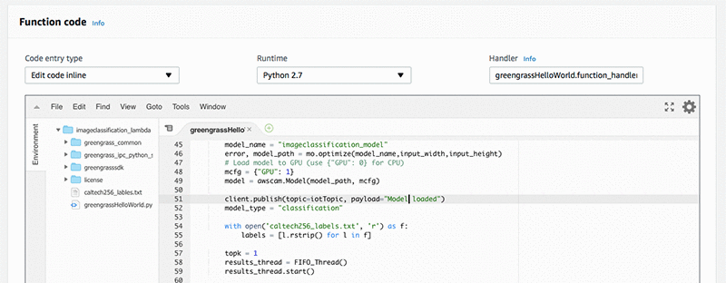

Replace existing code with code below

```
#Insert imageclassification_lambda.py
#
# Copyright Amazon AWS DeepLens, 2017
#

import os
import greengrasssdk
from threading import Timer
import time
import awscam
import cv2
import mo
from threading import Thread

# Creating a greengrass core sdk client
client = greengrasssdk.client('iot-data')

# The information exchanged between IoT and clould has 
# a topic and a message body.
# This is the topic that this code uses to send messages to cloud
iotTopic = '$aws/things/{}/infer'.format(os.environ['AWS_IOT_THING_NAME'])
jpeg = None
Write_To_FIFO = True

class FIFO_Thread(Thread):
    def __init__(self):
        ''' Constructor. '''
        Thread.__init__(self)
 
    def run(self):
        fifo_path = "/tmp/results.mjpeg"
        if not os.path.exists(fifo_path):
            os.mkfifo(fifo_path)
        f = open(fifo_path,'w')
        client.publish(topic=iotTopic, payload="Opened Pipe")
        while Write_To_FIFO:
            try:
                f.write(jpeg.tobytes())
            except IOError as e:
                continue  

def greengrass_infinite_infer_run():
    try:
        input_width = 224
        input_height = 224
        model_name = "image-classification"
        error, model_path = mo.optimize(model_name,input_width,input_height, aux_inputs={'--epoch': 3})
        # The aux_inputs is equal to the number of epochs and in this case, it is 3
        # Load model to GPU (use {"GPU": 0} for CPU)
        mcfg = {"GPU": 1}
        model = awscam.Model(model_path, mcfg)
        
        client.publish(topic=iotTopic, payload="Model loaded")
        model_type = "classification"
        
        with open('caltech256_labels.txt', 'r') as f:
	        labels = [l.rstrip() for l in f]
	   
        topk = 5
        results_thread = FIFO_Thread()
        results_thread.start()

        # Send a starting message to IoT console
        client.publish(topic=iotTopic, payload="Inference is starting")

        doInfer = True
        while doInfer:
            # Get a frame from the video stream
            ret, frame = awscam.getLastFrame()
            # Raise an exception if failing to get a frame
            if ret == False:
                raise Exception("Failed to get frame from the stream")

            # Resize frame to fit model input requirement
            frameResize = cv2.resize(frame, (input_width, input_height))
        
            # Run model inference on the resized frame
            inferOutput = model.doInference(frameResize)

            # Output inference result to the fifo file so it can be viewed with mplayer
            parsed_results = model.parseResult(model_type, inferOutput)
            top_k = parsed_results[model_type][0:topk]
            msg = '{'
            prob_num = 0 
            for obj in top_k:
                if prob_num == topk-1: 
                    msg += '"{}": {:.2f}'.format(labels[obj["label"]], obj["prob"]*100)
                else:
                    msg += '"{}": {:.2f},'.format(labels[obj["label"]], obj["prob"]*100)
            prob_num += 1
            msg += "}"  
            
            client.publish(topic=iotTopic, payload = msg)
	    cv2.putText(frame, labels[top_k[0]["label"]], (0,22), cv2.FONT_HERSHEY_SIMPLEX, 1, (255, 165, 20), 4)
            global jpeg
            ret,jpeg = cv2.imencode('.jpg', frame)
            
    except Exception as e:
        msg = "myModel Lambda failed: " + str(e)
        client.publish(topic=iotTopic, payload=msg)
    
    # Asynchronously schedule this function to be run again in 15 seconds
    Timer(15, greengrass_infinite_infer_run).start()


# Execute the function above
greengrass_infinite_infer_run()


# This is a dummy handler and will not be invoked
# Instead the code above will be executed in an infinite loop for our example
def function_handler(event, context):
    return
 
```
 
To add the text file to your lambda function: In the Function code block, choose File. Then choose New File, add following code, then save file as caltech256_labels.txt


```

#Insert caltech256_labels.txt

0 ak47
1 american-flag
2 backpack
3 baseball-bat
4 baseball-glove
5 basketball-hoop
6 bat
7 bathtub
8 bear
9 beer-mug
10 billiards
11 binoculars
12 birdbath
13 blimp
14 bonsai-101
15 boom-box
16 bowling-ball
17 bowling-pin
18 boxing-glove
19 brain-101
20 breadmaker
21 buddha-101
22 bulldozer
23 butterfly
24 cactus
25 cake
26 calculator
27 camel
28 cannon
29 canoe
30 car-tire
31 cartman
32 cd
33 centipede
34 cereal-box
35 chandelier-101
36 chess-board
37 chimp
38 chopsticks
39 cockroach
40 coffee-mug
41 coffin
42 coin
43 comet
44 computer-keyboard
45 computer-monitor
46 computer-mouse
47 conch
48 cormorant
49 covered-wagon
50 cowboy-hat
51 crab-101
52 desk-globe
53 diamond-ring
54 dice
55 dog
56 dolphin-101
57 doorknob
58 drinking-straw
59 duck
60 dumb-bell
61 eiffel-tower
62 electric-guitar-101
63 elephant-101
64 elk
65 ewer-101
66 eyeglasses
67 fern
68 fighter-jet
69 fire-extinguisher
70 fire-hydrant
71 fire-truck
72 fireworks
73 flashlight
74 floppy-disk
75 football-helmet
76 french-horn
77 fried-egg
78 frisbee
79 frog
80 frying-pan
81 galaxy
82 gas-pump
83 giraffe
84 goat
85 golden-gate-bridge
86 goldfish
87 golf-ball
88 goose
89 gorilla
90 grand-piano-101
91 grapes
92 grasshopper
93 guitar-pick
94 hamburger
95 hammock
96 harmonica
97 harp
98 harpsichord
99 hawksbill-101
100 head-phones
101 helicopter-101
102 hibiscus
103 homer-simpson
104 horse
105 horseshoe-crab
106 hot-air-balloon
107 hot-dog
108 hot-tub
109 hourglass
110 house-fly
111 human-skeleton
112 hummingbird
113 ibis-101
114 ice-cream-cone
115 iguana
116 ipod
117 iris
118 jesus-christ
119 joy-stick
120 kangaroo-101
121 kayak
122 ketch-101
123 killer-whale
124 knife
125 ladder
126 laptop-101
127 lathe
128 leopards-101
129 license-plate
130 lightbulb
131 light-house
132 lightning
133 llama-101
134 mailbox
135 mandolin
136 mars
137 mattress
138 megaphone
139 menorah-101
140 microscope
141 microwave
142 minaret
143 minotaur
144 motorbikes-101
145 mountain-bike
146 mushroom
147 mussels
148 necktie
149 octopus
150 ostrich
151 owl
152 palm-pilot
153 palm-tree
154 paperclip
155 paper-shredder
156 pci-card
157 penguin
158 people
159 pez-dispenser
160 photocopier
161 picnic-table
162 playing-card
163 porcupine
164 pram
165 praying-mantis
166 pyramid
167 raccoon
168 radio-telescope
169 rainbow
170 refrigerator
171 revolver-101
172 rifle
173 rotary-phone
174 roulette-wheel
175 saddle
176 saturn
177 school-bus
178 scorpion-101
179 screwdriver
180 segway
181 self-propelled-lawn-mower
182 sextant
183 sheet-music
184 skateboard
185 skunk
186 skyscraper
187 smokestack
188 snail
189 snake
190 sneaker
191 snowmobile
192 soccer-ball
193 socks
194 soda-can
195 spaghetti
196 speed-boat
197 spider
198 spoon
199 stained-glass
200 starfish-101
201 steering-wheel
202 stirrups
203 sunflower-101
204 superman
205 sushi
206 swan
207 swiss-army-knife
208 sword
209 syringe
210 tambourine
211 teapot
212 teddy-bear
213 teepee
214 telephone-box
215 tennis-ball
216 tennis-court
217 tennis-racket
218 theodolite
219 toaster
220 tomato
221 tombstone
222 top-hat
223 touring-bike
224 tower-pisa
225 traffic-light
226 treadmill
227 triceratops
228 tricycle
229 trilobite-101
230 tripod
231 t-shirt
232 tuning-fork
233 tweezer
234 umbrella-101
235 unicorn
236 vcr
237 video-projector
238 washing-machine
239 watch-101
240 waterfall
241 watermelon
242 welding-mask
243 wheelbarrow
244 windmill
245 wine-bottle
246 xylophone
247 yarmulke
248 yo-yo
249 zebra
250 airplanes-101
251 car-side-101
252 faces-easy-101
253 greyhound
254 tennis-shoes
255 toad
256 clutter

```

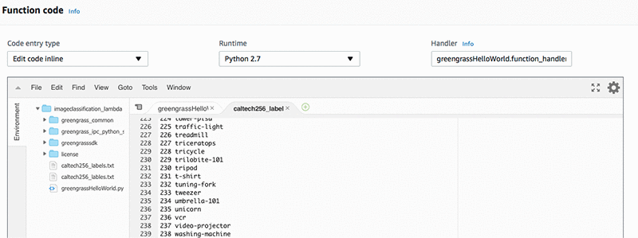

Save the lambda function


Now deploy the lambda function by selecting Actions dropdown button. And then select Publish new version


This will pop up new box. You can keep version description blank, and choose Publish. This will publish the lambda function.

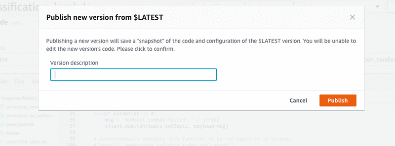

Once done, add the lambda function to the project and choose Create new project to finish the project creation.
You will see your project created in the Projects list.


 

Once the project is created, select the project and choose Deploy to device. Choose your target AWS DeepLens device. Choose Review.

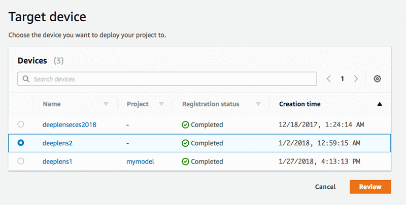


Now you are ready to deploy your own object detection model. Choose Deploy.

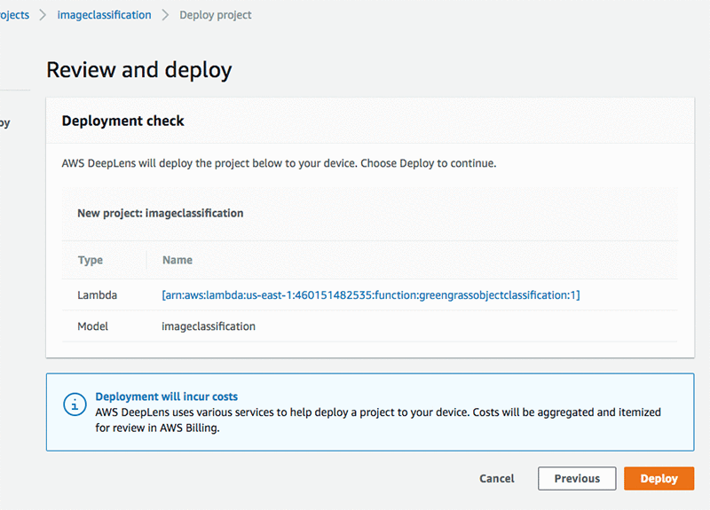
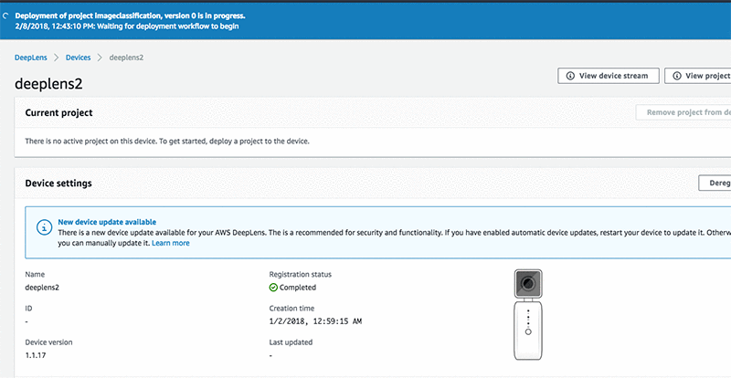

Congratulations! You have built your own object classification model based on a dataset and deployed it to AWS DeepLens for inference.
